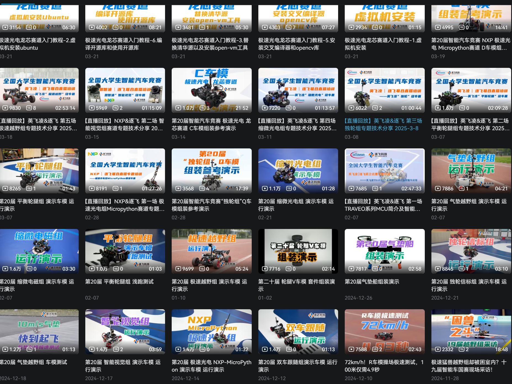
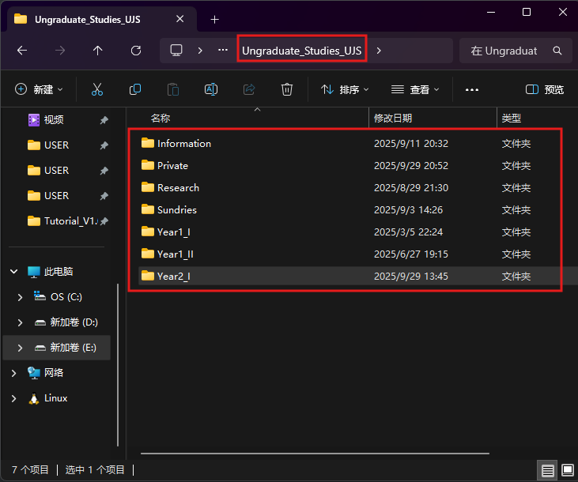
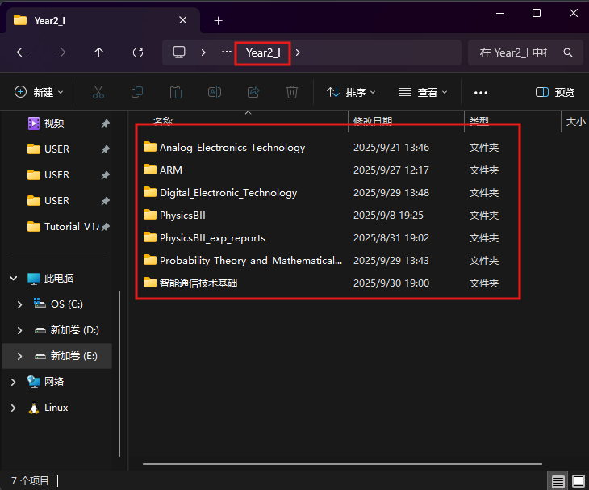
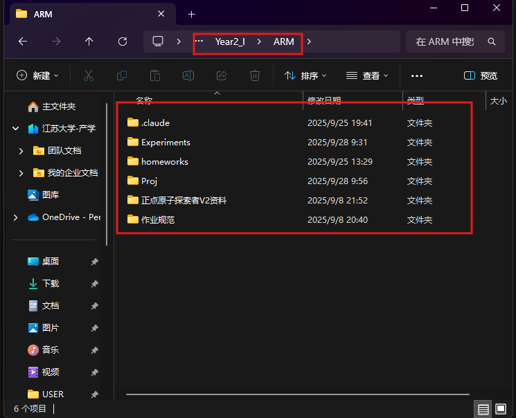
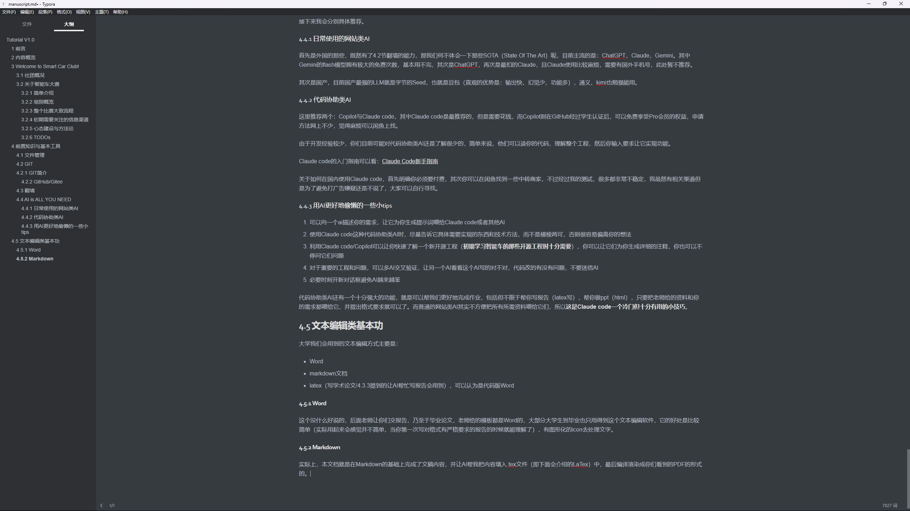
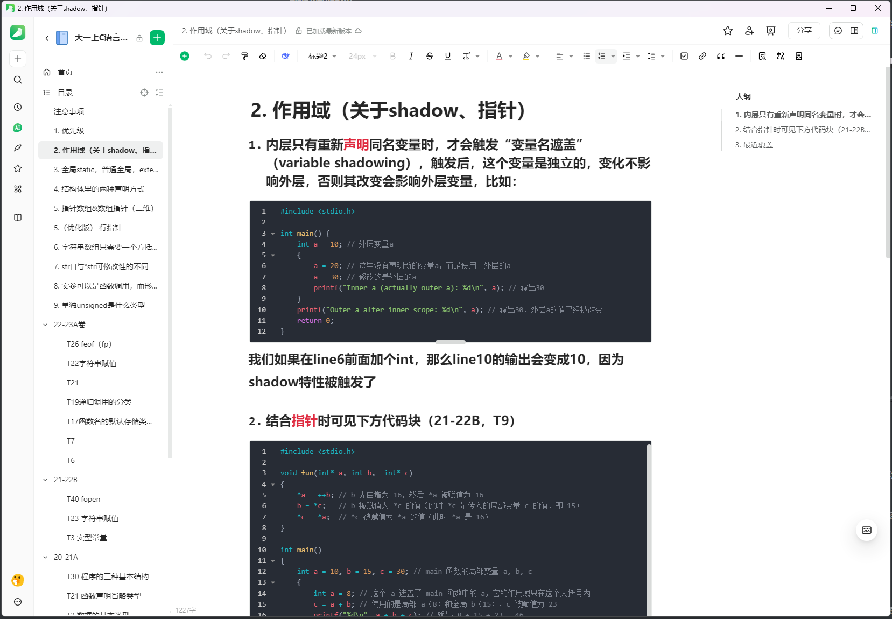
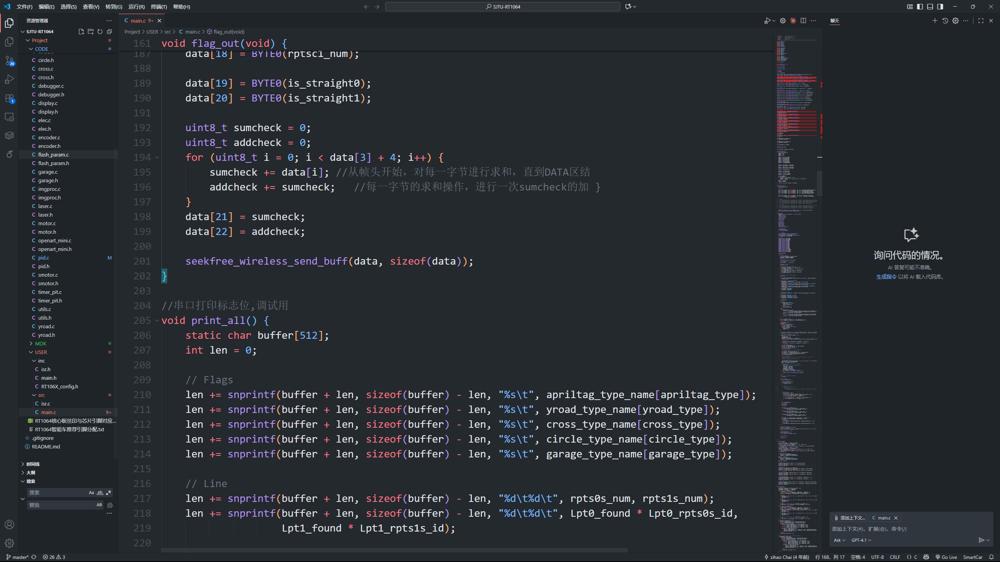
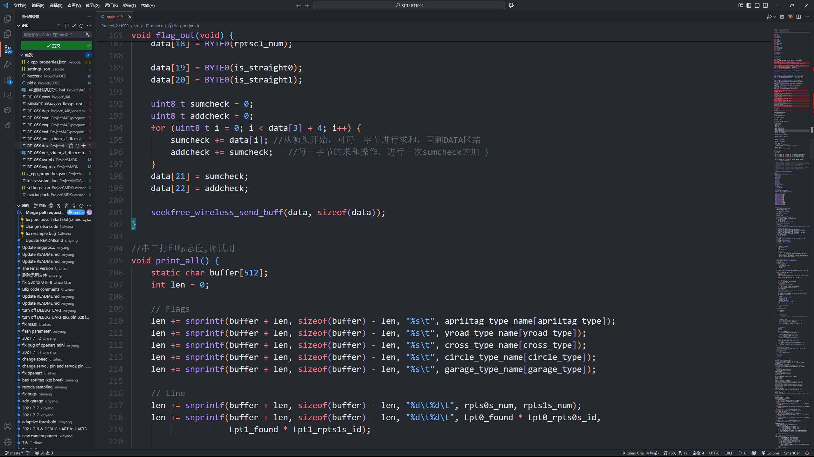

# Tutorial V1.0
由于本人第一次写这样的文档，所以肯定有不少不足的地方，比如内容看起来又臭又长，主要还是因为文笔太差，且想讲的东西太多，不过我会尽量减少废话说一些干货的，希望看完对你有帮助🥹。（**为了避免我写的太长大家看不进去，每个一级标题的最后会总结中你们比较有必要做的TODOs**）

## 1 前言
本文来来回回思考良久，虽然脑中有很多想输出的东西，但是总是难以规划好行文结构。本打算写一次性一本tutorial作为指导手册，但是最终考虑工程量巨大，且不方便及时向你们发送，会耽误各位的学习进度，因此最终选择了暂时先发布这个Tutorial I。

在此之前，我先简单自我介绍一下：我是通信2402的徐奕博（群头像合照右三就是我），2024年时和你们一样作为新生加入了智能车社团并选择了软件组（关于这个所谓软件组具体是什么下面会介绍），当时的培训个人认为是比较欠缺的，只给出了大概半页PDF简单说明了要学的内容和考核内容。虽然本人个人事务繁重，课业，竞赛，科研三头抓，但是为了能让大家加入社团之后能真正学到点东西，并且少走一些不必要的弯路，还是决定进行详细些地指导。

在我的构想中，培训的内容会远远超出智能车本身，这些扩展内容包括但不限于：
* 工科生基本功，如：latex，md文档，git，wsl，vscode
* 提升效率的工具：尤其是各种AI工具
* 科研基本功：文献管理工具（如zotero，endnote，这里更推荐zotero），绘图（Visio，Adobe illustrator，PowerPoint等），文献查找
* ...

（对于非保研党，“科研基本功”这个部分是不必要的）

不过由于本人实在时间有限，这个大坑恐怕是很难填上的，甚至很有可能到最后也只更了这个第一部😭。不过即使不能全部写成教程，以上内容还是可以让你们对未来可能所需要学习的东西有一个简单的了解。

Tips：大家尽量不要问我问题，鼓励在群内讨论，因为我始终认为：通过自己努力解决问题是一个过程痛苦却也必要的技能。这对你来说是一个探索的过程，在此期间你将提升自己检索信息的能力，同时培养自己的耐心和抗压能力，这二者在你后续的学习和比赛过程中都是十分必要的。

## 2 内容概览
正如前言所说，最后很可能只有这个L1，所以尽量这次把必要的一些东西给介绍了，且作为智能车软件组的培训，我还是打算先介绍智能车强相关的东西，具体将包括：

* 智能车社团与比赛简单介绍，包括如何比赛，整个比赛流程，方法论/心态上的建设（这个其实很重要），等等
* 必要的前置知识和效率提升工具（这个不局限于智能车比赛）
* 智能车初期学习路线与考核内容

## 3 Welcome to Smart Car Club!

### 3.1 社团概况

智能车社团是一个历史悠久的竞赛类社团，主要聚焦于工科专业，尤其是EE/CS/机械等领域。虽然名字叫智能车创新社，但实际上我们所参与的比赛并不局限于智能车，甚至不少人虽然在智能车社团，但是并不参与智能车比赛，所以它其实更像一个学习交流的平台，具体来说，你可以：

- 学技术，打比赛
- 在实验室获得工位学习（这个资源比较稀缺，需要主动一些争取或者申请，~~欢迎各位学妹加入😍~~）
- 结交人脉，获得竞赛资源、互相帮忙组队打比赛（~~互相挂名加保研分~~）
- 如果有同专业或类似专业的学长/学姐，可以请教学习，了解很多学习（如何卷绩点）上的事情
- ...

以上只是你能获得的东西的冰山一角，真正的红利需要加入之后才能完全了解，总之，加入我们，好处是十分之多的。

### 3.2 关于智能车大赛

#### 3.2.1 简单介绍

智能车大赛，更完整的称呼是——全国大学生智能汽车竞赛（官网：[全国大学生智能汽车竞赛](http://www.smartcarrace.com/)）。该赛事最初是由清华大学自动化系的**卓晴**副教授（<u>此人十分重要，后面要考</u>）所发起的，至今已经举办了20届，第20届国赛于2025年8月在杭州电子科技大学（虽然也是双非，但是此学校打比赛十分厉害，尤其是智能车和ACM）举办。而从第21届开始，智能车大赛将会进行巨大的调整，具体会做哪些调整，暂时也不得而知，需要等到11月份才能了解具体内容（据说会有载人汽车、空地协同，听着还挺好玩的）。[卓大和英飞凌曹总带你看第20届智能车总决赛-现场解密“养成式”成长之路_哔哩哔哩_bilibili ](https://www.bilibili.com/video/BV16tH2zKEdW/?spm_id_from=333.337.search-card.all.click&vd_source=ecdd1afdd06f2e0d54e3a584361f8d3b)是20届国赛后的一个小汇总视频，感兴趣可以看看。

不过说来说去，大家可能还不知道智能车是干什么的，**简单来说，就是造个小车，然后放在赛道上跑**，具体怎么跑，就和具体你选择的赛道有关了，其中大部分是利用灰度摄像头处理捕捉到的一帧一帧的赛道信息，经过一通处理，就可以得到类似如图 3.1所示的画面，其中蓝色的中线坐标就指引了你的小车应该怎么走。以上技术细节都是题外话，不是本次Tutorial的重心，只是让大家有一个大致的了解，实际上要处理的问题比这复杂的多。


​                                                                         						  图 3.1 灰度摄像头处理图像结果演示

#### 3.2.2 组别概览

智能车的组别是十分丰富的，每年都多多少少会产生一些变化，以下是20届也就是最近一届所包含的组别，**不过仅供参考，因为21届会大改革**：

​                                                                                            				表 3-1  竞速比赛组别一览表

| 序号 | 组别名称       | 比赛环境         | 比赛任务描述                                                                                                                                                                                                 | 传感器                               | MCU平台                                  | 车模                                 |
| ---- | -------------- | ---------------- | ------------------------------------------------------------------------------------------------------------------------------------------------------------------------------------------------------------ | ------------------------------------ | ---------------------------------------- | ------------------------------------ |
| 1    | 缩微电磁       | 缩微电磁赛道     | （1）自制车模，在赛道上运行两周；<br>（2）车模运行电源来自储能法拉电容；（3）自制无线充电发射与接收电路；<br>（4）赛道上没有路障，没有坡道，具有六边形环岛；                                                   | 电磁线圈                             | STC（专科、本科）                       | 自制车模                             |
| 2    | 缩微光电       | 缩微光电赛道     | （1）使用制定车模在赛道上运行两周；<br>（2）赛道为蓝色地面，白色中心引导线（宽度20±5mm）；<br>（3）赛道具有若干断路区、虚线区；<br>（4）允许车模增加负压风扇；<br>（5）赛道元素不包含路障、坡道，包含六边形环岛； | 光电管、摄像头                       | Infineon TRAVEO系列单片机                | 自制车模                             |
| 3    | 极速光电       | 普通室内赛道     | （1）使用四轮车模在赛道上运行一周；<br>（2）允许自行在赛道旁增加指示路标，预赛路标小于5个，决赛路标小于10个；<br>（3）允许车模增加负压风扇，负压电机驱动的芯片可以在STC，Infineon，NXP中选用；<br>（4）赛道元素包括路障、环岛、坡道等；<br>（5）龙芯车模中摄像头镜头中心距离地面垂直距离小于20厘米；MicroPython赛道车模对于摄像头的高度没有限制； | 光电管、摄像头                       | （1）龙芯赛道<br>（2）NXP MicroPython赛道 | （龙芯）四轮车模<br>（NXP）D,E平衡车模 |
| 4    | 平衡轮腿       | 普通室内赛道     | （1）使用轮腿平衡车模完成赛道运行一周；<br>（2）赛道特殊元素包括有单边桥、垂直横断路；<br>（3）普通赛道元素包括环岛、坡道、路障等；                                                                             | 光电管、摄像头                       | Infineon AURIX TRAVEO                   | 轮腿V,W车模                          |
| 5    | 双车跟随       | 普通室内赛道     | （1）制作两个车模，跟随在赛道上运行一周；<br>（2）两个车模前车使用三轮车模、后车使用四轮车模；<br>（3）后车需要跟随前车运行，要求后车所使用的摄像头放置在车模后面，距离前轮轴线的水平距离大于15厘米，镜头中心高度不超过10厘米，摄像头镜头保持水平或者仰视状态；<br>（4）两个车模之间不允许使用无线、超声进行通讯，但可以通过LED、声音等进行导引；如果使用可见光和声音引导，则要求可见光灯板驱动使用英飞凌LED驱动芯片（TLD7002、TLD2331）制作电路，如果使用红外LED完成引导，则没有驱动芯片的限制；如果使用声音传递信息，则要求使用英飞凌硅麦传感器接收声音信号；<br>（5）允许车模增加负压风扇，负压无刷电机驱动的芯片可以在STC，Infineon，NXP中选用；<br>（6）赛道元素包括环岛，没有坡道和路障； | 光电管、摄像头、硅麦                 | Infineon、NXP、STC、龙芯开发板           | 三轮车模、四轮车模                   |
| 6    | 独轮信标       | 普通室内赛道     | （1）使用独轮车模完成发光信标的检测与压过；<br>（2）光电信标发射红光和红外光；<br>（3）信标等可以同时点亮1至5个不等；<br>（4）车模中途倒伏之后，允许从发车区重新开始；                                                                 | 摄像头、UWB                          | Infineon                                 | 独轮车模                             |
| 7    | 智能视觉       | 普通室内赛道     | （1）使用福来全向（Y型车模）完成赛道一周运行；<br>（2）赛道上分布有外表粘贴有图案的立方体；<br>（3）车模检测到立方体，能够识别上面的图案种类；<br>（4）将立方体按照液体和固体大类分别推离到赛道左右；<br>（5）物品小类存储之后，在比赛完毕之后通过屏幕显示出来；<br>（6）详细规范参见《第二十届全国大学生智能汽车竞赛 视觉组比赛细则》 | 摄像头                               | NXP                                     | 全向Y型车模                          |
| 8    | 极速越野       | 室外操场赛道     | （1）在室外赛道场地完成三个科目测速比赛；<br>（2）科目1：往返赛道竞速；<br>（2）科目2：八字型赛道竞速；<br>（3）科目3：特殊路况竞速：过路障、草地、桥洞；<br>（4）* 第二十届全国大学生智能汽车竞赛极速越野组 新增科目四比赛内容相关说明 | 摄像头、GPS（不包括RTK）、惯性导航   | Infineon（专科、本科）                   | 四轮越野车模                         |
| 9    | 气垫越野       | 室外操场赛道     | （1）在室外赛道场地完成三个科目测速比赛；<br>（2）科目1：往返赛道竞速；<br>（2）科目2：八字型赛道竞速；<br>（3）科目3：特殊路况测速，过路障、草地、桥洞；                                                                             | 摄像头、GPS（不包括RTK）、惯性导航   | STC                                     | 自制气垫车模                         |
| 10   | 完全模型       | 室内赛道         | （1）在室内赛道基础上，添加完全模型组任务引导标志和元素，并完成完全模型赛道任务；<br>（2）细则参见《第二十届全国大学生智能汽车竞赛-竞速比赛 百度完全模型组规则V1.0》                                                                       | 摄像头                               | STC、NXP、Infineon                       | I车模                                |

注：以上数据摘自 [第二十届全国大学生智能汽车竞速比赛规则_20届智能车-CSDN博客](https://blog.csdn.net/zhuoqingjoking97298/article/details/143673441?ops_request_misc=%7B%22request%5Fid%22%3A%22f563fd0a7631e9e2b2af086b6d90e76b%22%2C%22scm%22%3A%2220140713.130102334.pc%5Fblog.%22%7D&request_id=f563fd0a7631e9e2b2af086b6d90e76b&biz_id=0&utm_medium=distribute.pc_search_result.none-task-blog-2~blog~first_rank_ecpm_v1~rank_v31_ecpm-1-143673441-null-null.nonecase&utm_term=20届智能车&spm=1018.2226.3001.4450)

#### 3.2.3 整个比赛大致流程

1. 每年大约11月初会在**卓晴的CSDN账号（[卓晴-CSDN博客](https://zhuoqing.blog.csdn.net/?type=blog)）**发布下一年比赛的规则,这个规则是一个总的规则，后续会陆陆续续发布各个赛道更详细的细则（PS：**同时还请关注卓晴的公众号**，他经常会在一些推文的评论区回复参赛选手对规则的疑惑，~~以及一些莫名其妙的广告~~，神人卓晴有可能对一些赛道到最终比赛都没用细则，并且经常出现说辞前后不一的状况，你们要慢慢习惯😂）
2. 接下来你们必须要认识的就是智能车的两大赞助商——**逐飞、龙邱**，他们会根据规则做赛题验证并发布于b站（如 图3.2所示），包括运行演示，入门教程（**主要就是给我们一个做出能符合规则去运行的小车的思路，这个视频是十分重要的参考**），车模装配（99%的情况下，车模都是买的成品，但是一些赛道比如智能视觉组，需要自己利用碳素杆设计一些布局，同时往届智能视觉会需要自己设计车模，难度与工作量十分之大）等，**所以实际上智能车也不是我们完全手搓出来的，很多东西我们是有成品和指引的，所以大家不必过分微距**，比如车模（当然，装车模也是一个十分痛苦的过程，后面真正备赛时经常需要拆装车模去更换PCB板等）。



​                                                                                                                 图3.2 逐飞b站视频

3. 发布视频的同时期，逐飞/龙邱等赞助商会在淘宝上架各个组别的比赛套件，买回来之后就可以进行开发、学习（**注意：赞助商提供的各种PCB叫学习板，仅供前期学习使用，当然也可以作为后期硬件调试的对照组，最终需要你的硬件队友帮你画出来并打板**）
4. 同时，你可以加入你对应组别的交流群（逐飞/龙邱官方创建的，通常逐飞的群会活跃一些）；且逐飞/龙邱的入门视频并不会给出代码细节，你需要多去b站/CSDN/Github/知乎/Gitee找开源代码学习。
5. 接下来就是不停地以完赛为标准去移植开源、改代码、调试、软硬件协调（毕竟你要保证队友画的板子能跑你的代码，不会烧），最后报名、参赛。

#### 3.2.4 初期需要关注的信息渠道

- 卓晴的公众号、CSDN账号、b站账号（比赛规则等）
- 逐飞科技、龙邱科技的b站账号（规则发布后会有赛题验证、车模组装、备赛指导、QQ交流群等）

#### 3.2.5 心态建设与方法论

智能车是一个含金量十分高的比赛，这必然也对应着其难度的巨大，因此，做好心理建设是十分必要的，但是对应的，在此过程中你会极大程度地提升自己的技术能力，这里的技术能力不仅仅是编程等狭义的技术，更包括工程开发与学习中所需的：极强的耐心与抗压能力、强大的信息检索能力与自己解决问题的能力。

同时，由于我们学校的智能车向来没有传承代码，很多时候需要自己“拓荒”，那么这时候——**开源代码与闲鱼**将是我们最伟大的“传承”。大部分人对开源代码应该可以理解，但是为什么会说闲鱼很重要？实际上，在备赛过程中，许多人为了赚点小外快，会在闲鱼上发布一些自己效果比较好的代码以及技术指导（不过务必小心甄别防止遇到骗子，骗子还是不少的），你现在可能会对此有些不齿，但是我们不得不承认，没有足够的传承，这是我们能做的最好选择。

#### 3.2.6 TODOs

- [ ] 观看3.2.1 - 3.2.2节，对智能车有简单了解，并根据表格看看感兴趣的组别，在b站搜索其20届的国赛现场视频观赏
- [ ] 根据3.2.3节，对比赛流程有大致了解
- [ ] 关注 3.2.4节提到的信息渠道

## 4 前置知识与基本工具

这一节写的效果远远没有达到我原本的期望，主要是因为需要控制篇幅，并且我时间实在缺乏，这里面提到的东西其实都非常重要和好用，但是我没能很好地体现出来，希望大家可以理解。

### 4.1 文件管理

不管是为了方便查找资料，还是避免在使用国外软件时出现一些不必要的报错，请大家在管理文件夹时尽量遵循以下规则：

- 文件夹名称只用英文命名
- 在一开始就组织好清晰、分类明确的的文件夹结构，比如建一个Software文件夹，以后安装的软件就都放在其中；建一个Competition文件夹，里面存放各种比赛相关的内容；建一个Undergraduate_Studies_UJS文件夹，里面按学期再建文件夹，再在各学期的文件夹里建立各门课的文件夹，再在里面存放学习资料、PPT、作业等内容
- 命名时，尽量只用英文字母、下划线（即_）、数字，不要用括号、汉字、点（即.）

下面三张图是我课内学习文件夹的组织形式，作为一个示例。



​																								图 4.1 Undergraduate_Studies_UJS文件夹



​																								   图 4.2 Year2_I(即大二上学期)文件夹



​																										图 4.3 ARM（某一门课）文件夹

### 4.2 GIT

#### 4.2.1 GIT简介

简单来说，GIT是一个用于团队协作开发和版本控制的工具，利用它，你可以在每一次修改后提交一次，并随时checkout回过去你提交过的stage，如果你玩过游戏的话，可以把它理解为一种存档，当然，它还能让你的整个开发流程更加清晰；同时，你和另一个队友在分工后，可以分别创建一个分支（branch），负责不同的部分，并在必要时合并（merge）你们各自的代码。具体介绍可以看看[Git是什么 - Git教程 - 廖雪峰的官方网站](https://liaoxuefeng.com/books/git/what-is-git/index.html)。

安装过程并不困难，在网上（如b站）有很多教程。

#### 4.2.2 GitHub/Gitee

Github是一个免费的代码托管平台，利用上面安装的GIT你可以用命令推送（push）你的工程到GitHub上，方便你和他人分享项目或者方便自己管理项目，当别人觉得你的代码很好，他们可以给你点击Star，这个Star如果能积累到很高的数量，在未来工作、保研复试中都会有很大的帮助，当然这是比较难做到的。

**除此之外另一个十分重要的功能，就是找开源代码（如果你以后要做一些科研的话，甚至很多论文也会贴出其代码的GitHub仓库地址）**，利用 4.1节下载的GIT，你只需要在你想要安装的文件夹位置右键选择在终端打开，并输入

```bash
git clone 开源仓库的网址
```

当然clone通常有两种常见方式，一种是http，一种是ssh，不同的方式对应上述不同的网址，如果用ssh需要获取自己专属的ssh密钥，这些在网上乃至GitHub自己都有很多教程，不过多赘述。当然，**如果你实在不会弄git，也是可以直接下载压缩包的**，不过我并不推荐，这样太不专业。

Gitee与GitHub类似，可以当作国产GitHub，优点是不需要翻墙，缺点是资源远远比不上GitHub。但是，**逐飞和龙邱的开源库就上传在Gitee**，这个需要我们根据自己组别的mcu去下载对应的开源库（开源库是什么第5节会介绍）。

几个值得关注的仓库：

- [SJTU-AuTop/Openart-Code: SJTU-AuTop](https://github.com/SJTU-AuTop/Openart-Code) 上海交大智能视觉组开源代码，须配合其知乎文章与b站南信智能车培训视频（南信也是智能车超级强校，华东赛区基本年年都在南信办）使用（第5节会具体讲并给出链接）
- [caipingjiang/smart_car: 十九届智能汽车竞赛视觉组](https://github.com/caipingjiang/smart_car) 这个仓库的README写的非常有意思，完整记录了备赛过程，可以看看，提前感受一下智能车备赛的刺激
- [ittuann/Awesome-IntelligentCarRace: 智能车竞赛开源项目合集网站✨(恩智浦杯/飞思卡尔杯) | Awesome Intelligent Car Racing Competition Website✨(NXP Cup/Freescale Cup)](https://github.com/ittuann/Awesome-IntelligentCarRace) 智能车开源大集合（Cold Knowledge: 这种集合类的仓库习惯上都命名为 Awesome XXXX）
- [SeekFree (seekfree) - Gitee.com](https://gitee.com/seekfree) 逐飞Gitee主页，里面是各种MCU的开源库（所以需要先确定组别，从而确定用哪个MCU，从而确定用哪个开源库），比赛必然会用到。

### 4.3 翻墙

这个可以说是工科大学生必须掌握的技能，作用就是上外网。不少人应该也已经掌握了，没有它你甚至不能登录GitHub（不过GitHub其实有时候不翻墙也可以进去）。

我自己用的两个是：

- [彩云俱乐部](https://www.roosf.com/)
- [狗狗加速.com](https://v.dg6.im/#/register?code=oaxsAGo6)

二者都有不稳定的时候，前者建议买那个只要几十块一年的套餐，性价比这一块。

再次强调，翻墙是必备技能，不会的可以在群里和别人交流了解一下。

### 4.4 AI is ALL YOU NEED

这个不必过多介绍，想必大家已经十分了解，但是实际上大部分人没有充分发挥AI（更准确的说是LLM）的作用。

AI工具我愿将其分为两大类：

- 日常使用的网站类AI
- 代码协助类AI

接下来我会分别具体推荐。

至于为什么我说“AI is ALL YOU NEED”，因为实际上，只要你用的好，AI真的可以为你做任何事情，它可以大大提升你的效率，这是一个需要自己慢慢探索的过程。可以关注类似[橘鸦Juya的个人空间-橘鸦Juya个人主页-哔哩哔哩视频](https://space.bilibili.com/285286947?spm_id_from=333.337.search-card.all.click)这样的账号去了解一些前沿的LLM。

#### 4.4.1 日常使用的网站类AI

首先是外国的那些，既然有了4.3节翻墙的能力，那我们何不体会一下那些SOTA（State Of The Art）呢，目前主流的是：ChatGPT，Claude，Gemini。其中Gemini的flash模型拥有极大的免费次数，基本用不完，其次是ChatGPT，再次是最扣的Claude，且Claude使用比较麻烦，需要有国外手机号，此处暂不推荐。

其次是国产，目前国产最强的LLM就是字节的Seed，也就是豆包（直观的优势是：输出快、幻觉少、功能多），通义、kimi也勉强能用。

#### 4.4.2 代码协助类AI

这里推荐两个：Copilot与Claude code，其中Claude code是最推荐的，但是需要花钱，而Copilot则在GitHub经过学生认证后，可以免费享受Pro会员的权益，申请方法网上不少，觉得麻烦可以闲鱼上找。

由于开发经验较少，你们目前可能对代码协助类AI还是了解很少的，简单来说，他们可以读你的代码，理解整个工程，然后你输入要求让它实现功能。

Claude code的入门指南可以看：[Claude Code新手指南](https://www.bilibili.com/list/watchlater?oid=114805046314360&bvid=BV1kv3ez2E2B&spm_id_from=333.1369.top_right_bar_window_view_later.content.click)

关于如何在国内使用Claude code，首先明确你必须要付费，其次你可以在闲鱼找到一些中转商家，不过经过我的测试，很多都非常不稳定，我虽然有相关渠道但是为了避免打广告嫌疑还是不说了，大家可以自行寻找。

#### 4.4.3 用AI更好地偷懒的一些小tips

1. 可以向一个ai描述你的需求，让它为你生成提示词喂给Claude code或者其他AI
2. 使用Claude code这种代码协助类AI时，尽量告诉它具体需要实现的东西和技术方法，而不是模棱两可，否则很容易偏离你的想法
3. 利用Claude code/Copilot可以让你快速了解一个新开源工程（**初期学习智能车的那些开源工程时十分需要**），你可以让它们为你生成详细的注释，你也可以不停问它们问题
4. 对于重要的工程和问题，可以多AI交叉验证，让另一个AI看看这个AI写的对不对，代码改的有没有问题，不要迷信AI
5. 必要时刻开新对话框避免AI越来越笨

代码协助类AI还有一个十分强大的功能，就是可以帮我们更好地完成作业，包括但不限于帮你写报告（latex写），帮你做ppt（html），只要把老师给的资料和你的需求都喂给它，并提出格式要求就可以了。而普通的网站类AI其实不方便把所有所需资料喂给它们，所以**这是Claude code一个冷门但十分有用的小技巧**。

### 4.5 文本编辑类基本功

大学我们会用到的文本编辑方式主要是：

- Word
- markdown文档
- latex（写学术论文/4.3.3提到的让AI帮忙写报告会用到），可以认为是代码版Word

#### 4.5.1 Word

这个没什么好说的，后面老师让你们交报告，乃至于毕业论文，老师给的模板都是Word的，大部分大学生到毕业也只用得到这个文本编辑软件，它的好处是比较简单（实际用起来会感觉并不简单，当你第一次写对格式有严格要求的报告的时候就能理解了），有图形化的icon去处理文字。

#### 4.5.2 Markdown

实际上，本文档就是在Markdown的基础上完成了文稿内容（如下图 4.4所示），并让AI帮我把内容填入.tex文件（即下面会介绍的LaTex）中，最后编译渲染成你们看到的PDF的形式的。



​																								图 4.4 Markdown编辑界面示例（基于Typora）

**为什么推荐学习使用Markdown？**

首先，在你们今后遇见的所有的项目文件夹中，都会有一个**README.md**的东西，他会对整个项目进行一个介绍，而这里的.md文件就是所谓的Markdown。所以如果你们自己做项目，也是应该学习使用Markdown的（当然这个可以交给AI帮你基于整个项目总结）。

Markdown的书写形式有点类似于写代码，比如用“# 一级标题”，“## 二级标题”，通过输入＃号和空格就可以控制后面文本的标题等级，并自动生成大纲（如上图 4.4左侧所示）。这样只需要通过简单的操作就可以得到一份比较美观的文档。

其次，拿Markdown记笔记也是十分不错的选择，他支持Latex公式输入，以及插入代码块等等。

**如何使用Markdown？**

实际上现在市面上有很多基于Markdown推出的软件，比如国外的Obsidian，国内的语雀，我最初就是从语雀这个软件开始使用Markdown记录的（如图 4.5所示），他会有很多图形化的界面，支持快捷键，并且支持改变字体大小和颜色等等（这是原生Markdown不支持的），同时还可以与他人共享你的笔记。



​																												图 4.5 过去在语雀记的笔记

**学习资源**

- [官方学习文档](https://markdown.com.cn/basic-syntax/)（需要翻墙）
- [[Markdown + Typora/VSCode 超全教程\] 给大一新生安利的文本神器 !_哔哩哔哩_bilibili](https://www.bilibili.com/video/BV1hG411p7fX/?spm_id_from=333.1387.favlist.content.click&vd_source=ecdd1afdd06f2e0d54e3a584361f8d3b)

#### 4.5.3 LaTex

你可以认为是代码版的Word，他最大的好处就在于是用代码写的，这样你就可以直接让Claude code/Copilot来帮你写，只要你给出格式要求，就可以实现，这样在我们写课程报告时可以省去非常多排版时间（当你被Word折磨的受不了的时候，可以来试试我说的AI+LaTex写报告）。

同时，如果你要写论文，很多期刊会有自己的排版要求，他们会在官网发布各个期刊/会议的LaTex模板，所以如果你想保研去一个很好的学校（比如华五），那么你大概率需要有论文，那么你就不得不学习使用LaTex，当然，在AI的帮助下，这也并不是什么很困难的事情。

- 在本地编译需要安装XeLaTex，这个CSDN上就有很多教程，大家可以自行学习（安装非常慢，可能得一两个小时）。如果大家嫌麻烦，可以试试使用[您的项目 - Overleaf, 在线LaTeX编辑器](https://cn.overleaf.com/project)，如果你们后面要写论文，这个也是最常用的网站之一。

**可参考的教程**

- [MathJax basic tutorial and quick reference - Mathematics Meta Stack Exchange](https://math.meta.stackexchange.com/questions/5020/mathjax-basic-tutorial-and-quick-reference) 这里面主要是讲怎么输入公式的，实际上现在你完全可以把公式的图片扔给AI然后让它给你LaTex公式代码
- [简明LaTeX教程_哔哩哔哩_bilibili](https://www.bilibili.com/video/BV1ihYKeQEKH/?spm_id_from=333.337.search-card.all.click&vd_source=ecdd1afdd06f2e0d54e3a584361f8d3b)
- [科研论文党王炸组合overleaf+Copilot_哔哩哔哩_bilibili](https://www.bilibili.com/video/BV1RQALePEuu/?spm_id_from=333.337.search-card.all.click) （这个是我更推荐的一个工作流，*AI is ALL YOU NEED*）

### 4.6 代码编辑器（VSCODE）

VSCODE是微软推出的一款代码编辑器，是目前的主流选择，优点非常多，最直接的几个就是：

- 界面好看，可以自己选择主题，界面如下图所示（当然你自己可以配置很多东西，这只是我选择的主题）

  ​																								图 4.6 VSCODE界面示例

  - 如图 4.6右侧所示，就是我在 4.4.2节提到Copilot
  - 图形化的git操作，包括图形化git树显示（也就是你这个工程的整个提交过程通过图形显示），如下图左侧所示。

  

  ​																										图 4.7 左侧为图形化git

  - 丰富的插件生态，可以下很多官方/非官方的插件，来优化你的开发效率

  好处有很多，这里不一一罗列。在第5节会有推荐的学习视频，其中很多都有**VSCODE的安装教程**，所以这里先不提。

  ### 4.7 Linux

  受篇幅限制，这里不做过多介绍，智能车有一个新的**龙芯组别**需要在Linux环境下开发（逐飞/龙邱会在b站发教程，不需要担心），同时**智能视觉组**需要训练分类模型，而在Linux环境下，训练性能会比Windows高很多（这里可以了解WSL），除了这两个，其他组别应该和Linux毫无关系。

  ### 4.8 TODOs

  - [ ] 概览所有内容，即使你来不及做相应的配置，也大概有个概念，尤其是文件管理一定要做好，这对你以后是有很大帮助的

  ## 5 智能车入门完成学习路线

  上面讲了很多，其实到这里才是真正和智能车学习相关的内容。

  ### 5.1 C语言基础

  我想很多人应该暂时还没有C语言的基础，甚至一些专业大一是不需要学C语言的，但是嵌入式的开发是必须用到C语言的，并且很多专业本来就要学C语言，即使不学习C语言，有了C的基础，学习其他语言也是很有帮助的。这里我推荐你们观看一些速成视频即可，因为嵌入式开发不需要太多很高深的C语言技术，也不需要关心太多计算机底层的知识（C语言如果学的深一点会涉及一些计算机组成相关的较为底层的知识），更不必去刷算法题。如果本专业需要学习C语言，上课可以听老师讲，但是不要跟着学校进度走，这样效率太低。

  [一小时C语言教程_哔哩哔哩_bilibili](https://www.bilibili.com/video/BV1Q142147VL/?spm_id_from=333.1387.search.video_card.click)

  此视频还包括了VSCODE的配置内容，因此还是很不错的，当然如果看的不习惯，也可以选择其他博主的视频。

  实际上不需要在这里浪费太多时间，后面你在学习STM32的过程中慢慢就会用的越来越熟练，只需要先对各种基础语法有个简单概念，了解一些代码规范即可。

  ### 5.2 嵌入式学习

  #### 5.2.1 学什么芯片，用什么库？

  这里推荐大家直接学习STM32，而STM32分为寄存器开发、标准库开发和HAL库开发，其中寄存器开发最接近底层，HAL库则函数封装最完全（也就是把很多操作合并成一个操作，比如你初始化一个外设，本来需要十几行代码区控制一个个寄存器，但是利用hal库只需要执行一个init函数就行了，init函数已经包含了所有这些操作）。可以参考[用HAL库还是标准库？_哔哩哔哩_bilibili](https://www.bilibili.com/video/BV17dE7zCEbn/?spm_id_from=333.337.search-card.all.click&vd_source=ecdd1afdd06f2e0d54e3a584361f8d3b)对比的视频。

  由于智能车比赛是基于逐飞/龙邱的开源库开发的，他们的封装程度甚至比HAL库还高，所以直接学习HAL库即可。

  **总之，这里推荐学习STM32的HAL库开发。**不理解什么意思也没事，直接跟着5.2.2节推荐的视频学就行了。

  #### 5.2.2 视频推荐

  [keysking的个人空间-keysking个人主页-哔哩哔哩视频](https://space.bilibili.com/6100925?spm_id_from=333.788.upinfo.head.click) 动画精美，教学生动，是我当时的入门视频，推荐大家从第一集看起，对于不懂的地方要多看几遍，我第一次学到时钟树那里也感觉非常复杂难以理解，但是多看几遍之后慢慢就豁然开朗了，当然，为了不消磨学习兴趣，实在不明白的时候，照着视频里的代码照抄就行了，以后觉得有需要了再来深入理解底层。

  同时，Keysking近期也有很多在不同环境下开发的教程，这里可以先不急着使用，先把教程中基础的CubeIDE用好了再说。

  #### 5.2.3 开发环境

  上述的Keysking使用的是CubeIDE进行开发的，但是实际上我本来是希望大家用CubeMX+Keil+Vsocde开发的，但是担心大家配不好环境，因此可以先跟着Keysking的视频按部就班用CubeIDE学习即可。

  之所以本来推荐用CubeMX+Keil+Vsocde，是因为CubeIDE只支持ST公司的芯片，后续的智能车开发中可能用到的STC、NXP的芯片的用Keil开发的，而英飞凌的芯片则用他们自己的ADS这个软件进行开发。Keil支持的芯片可以说是最多的，且其强大的调试功能也是其他开发环境没有的。

  至于为什么需要CubeMX+Keil+Vsocde三个东西，这里就需要分别解释他们的作用：

  - CubeMX：利用图形化界面配置各个引脚，自动生成初始化代码
  - Keil：在CubeMX生成初始化代码和框架下，自己进一步编写代码，并编译、调试代码
  - Vscode：替代Keil的编写代码的功能，用更好看的界面来书写，并且方便使用Copilot/Claude code

  而keysking用的CubeIDE你可以理解为CubeMX+Keil，集成了图形化界面生成代码和编写、编译、调试代码的功能。

  同时要注意，CubeMX这样的图形化编程是ST公司的芯片独有的，其他芯片的开发通常没有，比如在智能车的开发中是没有CubeMX/CubeIDE这样的图形化界面的，但是结合逐飞/龙邱的开源库，开发难度甚至只会更低。

  总之，你们可以先保险地跟着Keysking用CubeIDE，一步步按部就班即可。

  #### 5.2.4 开发板

  如果要跟着Keysking的视频学习，最简单、问题最少的办法就是在淘宝购买其开发板，当然如果经济不支持，也可以不购买开发板，单纯看视频，跟着敲代码，不过这样应该是比较痛苦的。
  
  其他的，还有正点原子、江科大的开发板，我这里建议，买什么板子就跟着哪个教程走，这样可以最大程度减少麻烦。
  
  #### 5.2.5 后续进阶学习
  
  懒得写了，以后再说，毕竟上面这些够你们学的了。扔几个链接在这里。
  
  [通俗易懂的 PID 控制算法讲解_哔哩哔哩_bilibili](https://www.bilibili.com/video/BV1et4y1i7Gm/?spm_id_from=333.337.search-card.all.click)
  
  [【全56集】全网最细！手把手带你入门STM32平衡小车，包含所有干货！_哔哩哔哩_bilibili](https://www.bilibili.com/video/BV1YWCnYFEyp/?spm_id_from=333.337.search-card.all.click)
  
  [(91 封私信 / 81 条消息) 第16届智能车智能视觉组-上海交通大学AuTop战队开源汇总 - 知乎](https://zhuanlan.zhihu.com/p/391252945)
  
  [智能车上交AuTop算法的一些改进思路暨NUIST SCC第一次算法培训_哔哩哔哩_bilibili](https://www.bilibili.com/video/BV1mY411y76c/?spm_id_from=333.337.search-card.all.click&vd_source=ecdd1afdd06f2e0d54e3a584361f8d3b)
  
  重点包括一些：视觉算法、控制算法（PID控制，IMU，编码器、摄像头等等的使用）
  
  #### 5.2.6 TODOs
  
  - [ ] 这里内容也是要全看一遍，并且选择自己的开发板和视频，在等开发板到货的期间可以先看看视频，配配环境
  
  ## 6 关于考核
  
  11月初会进行面试考核，具体时间后续通知，你需要：
  
  - 介绍一下自己基于本文档或者自己的探索，学了哪些东西
  - 可以带电脑展示你学习的文件资料作为辅助
  - 介绍一下未来打算，比如是否打智能车，如果打智能车对哪些组别比较感兴趣
  
  实际上这些考核并不是为了筛人，而是希望大家能在学习过程中定期总结，并进行自我督促。大家也可以在交流群中多多交流讨论自己的学习问题，以及分享学习进度。
  
  ## 7 联络方式
  
  - QQ 总群：[185259885]
  - 软件组 QQ 群：[1065664979 ] 
  - 本人邮箱：xyb114xcmb@outlook.com
  
  ## 8 结语
  
  以上是本Tutorial的v1.0的所有内容，由于我有些写不动了，所以只能这样草草结束，实际上很多东西没用介绍清楚，包括那些基本工具，没能完全体现他们的必要之处，学习路线也写的不是那么完整清晰，也没能体现出智能车的魅力（事实上其魅力并非三言两语可以概括的，只有亲身经历才可以体会），整篇文档和我预期的效果差了很多，但是实在时间精力有限，望诸位谅解。
  
  如果有什么意见和不理解的地方，十分鼓励大家在群里多多讨论。
  
  最后，无论你是否加入智能车社团，是否打智能车大赛，都祝你们能度过一个有意义的大学生活，我坚信，只有时刻明确自己想要什么，才是最重要的。夫学之道，如行山阴道上，初涉则歧路纷然，稍进方识脉络。非独记诵之谓，更在体究于心；非仅见闻之广，尤贵践行于微。
  
  
  
  
  
  

